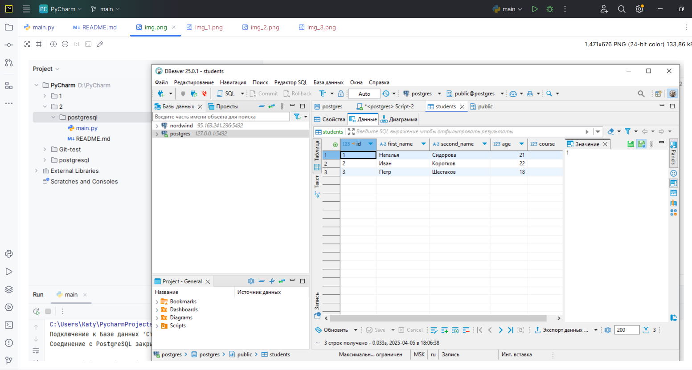
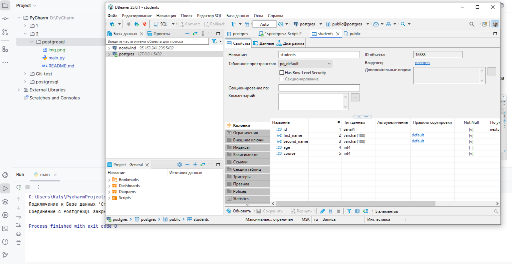
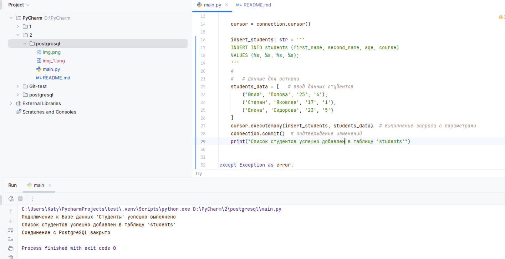
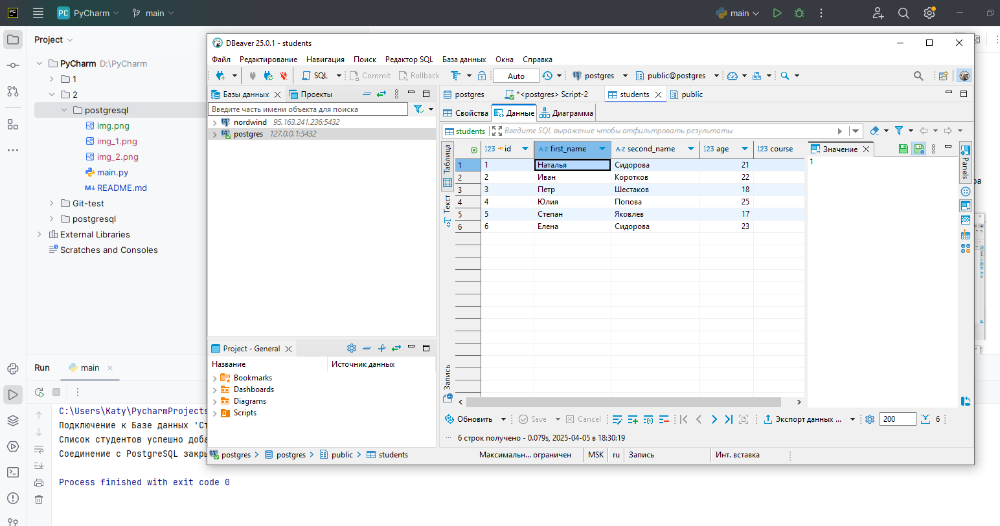
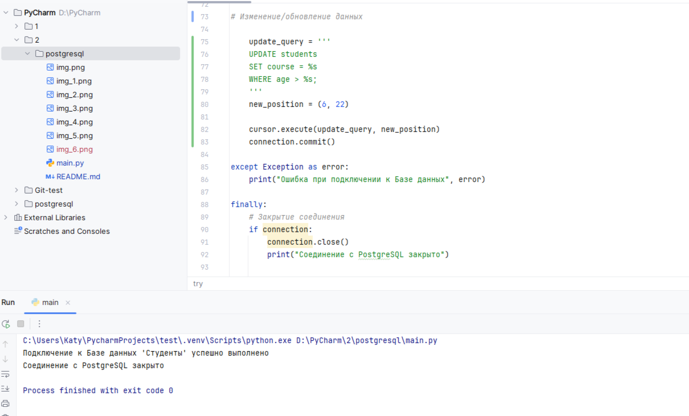
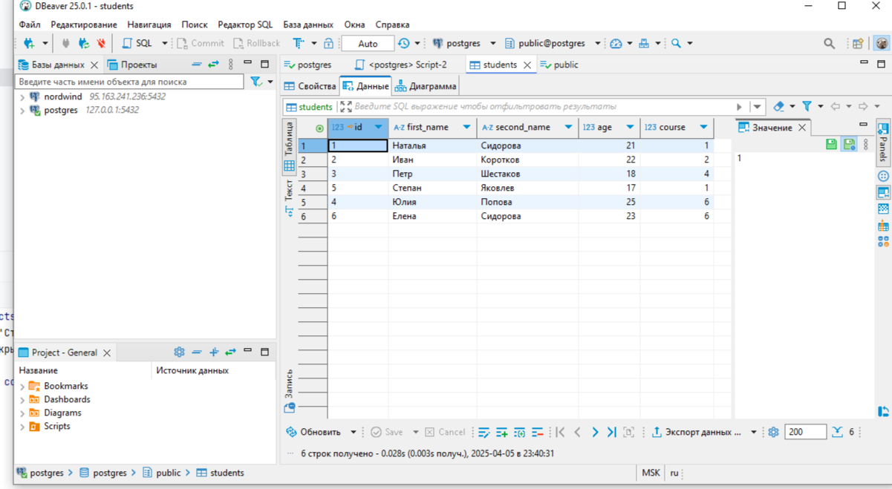
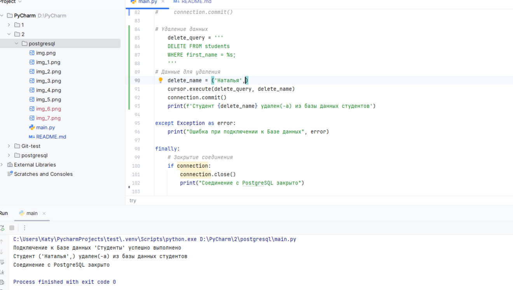
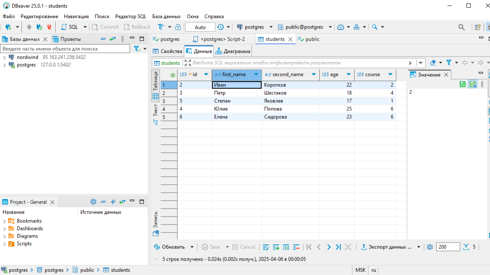
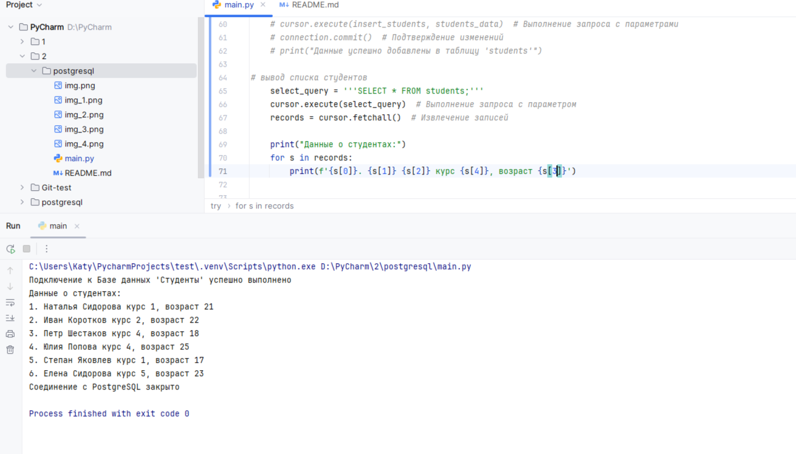

### Домашнее задание по теме postgreeSQL

## Задание:
1. Реализовать простую консольную программу учета студентов. 

2. Программа должна иметь функционал добавления, изменения, удаления, а также чтения базы данных. 

3. Таблица студентов должна состоять из: имени, фамилии, номера курса, возраста.

## Результат:

### 1. Добавлены студенты (список) через консоль PostgreSQL

### 2. Создана таблица с колонками: порядковый номер, имя, фамилия, возраст, номер курса
-Скриншот кода для добавления списка студентов с помощью кода в PyCharm 

-Скриншот списка студентов после второго добавления 

### 3. Изменение данных 
-Применение кода для изменения столбца course с условием для всех у кого возраст старше 22 лет:

-Результат применения кода изменения данных:

### 4. Удаление студента из списка
-Применение кода удаления студента из списка

- Скриншот из базы данных после удаления студента из списка

### 5. Просмотр списка 
